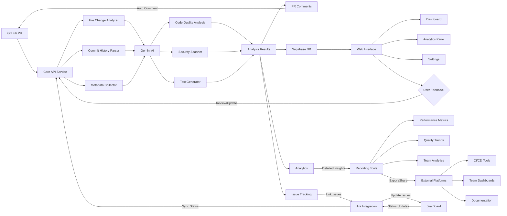

# AI-Integrated Code Pipeline

This is an AI-powered action designed to enhance code review and analyze file changes within a pull request by leveraging Gemini Nano to evaluate code quality, identify potential risks, suggest improvements, and generate tests automatically.
It integrates seamlessly with your GitHub workflows to provide insightful feedback directly within your pull requests. Now with Jira integration!

## ✨ Key Features

- **AI-Powered Code Review**: Automated analysis using Gemini Nano
- **Quality Analysis**: Identify code smells, anti-patterns, and improvement opportunities
- **Security Scanning**: Detect potential security vulnerabilities
- **Test Generation**: Automatic test case suggestions
- **Jira Integration**: Seamless issue tracking and updates
- **Analytics Dashboard**: Track code quality trends and team performance
- **GitHub Integration**: Native PR comments and workflow support


---


## Usage

### Prerequisites
- A GitHub repository
- GitHub Actions enabled
- An account on [Bunjy AI](https://bunjy.vercel.app)

### Step 1: Generate API Credentials
1. Visit [Bunjy AI](https://bunjy.vercel.app)
2. Log in with your GitHub account
3. On the homepage sidebar, navigate to "Access Tokens"
4. Generate a new API Key and Base app URL by clicking the generate button
5. Copy your unique `API_KEY` and `BASE_APP_URL`


### Step 2: Configure Repository Secrets
In your GitHub repository:
1. Go to "Settings"
2. Select "Secrets and variables"
3. Click "New repository secret"
4. Add the necessary secrets:
   - Name: `BASE_APP_URL`
     - Value: Your unique base URL from Bunjy AI
   - Name: `API_KEY`
     - Value: Your generated API key
   - For Jira integration (optional):
     - Name: `JIRA_BASE_URL`
       - Value: Your unique Jira instance URL
     - Name: `JIRA_USERNAME`
       - Value: Your Jira username (email associated with your Jira account)
     - Name: `JIRA_API_TOKEN`
       - Value: Your generated API Token
5. **For private repositories**, you will need to generate a GitHub Personal Access Token (PAT) and add it as a secret:
   - Name: `GH_PAT`
     - Value: Your generated GitHub PAT

### Step 3: Create a PAT
1. Go to **GitHub Settings > Developer Settings > Personal Access Tokens**
2. Generate a new token with the following permissions:
   - `repo` (Full control of private repositories)
   - `read:org` (Read organization membership details)
   - `workflow` (Update GitHub Actions workflows)
3. Copy the token and save it securely.

### Step 4: Create Workflow File
Create a `.github/workflows/ai.yml` file in your repository. Use the following template:

#### For Public Repositories:
```yaml
name: AI Code Review

on:
  pull_request:
    branches:
      '*'

jobs:
  ai:
    runs-on: ubuntu-latest
    steps:
      - name: Checkout code
        uses: actions/checkout@v4

      - name: Bunjy AI Code Review              
        uses: mohswell/mintify@v2.8.3
        with:
          BASE_APP_URL: ${{ secrets.BASE_APP_URL }}
          API_KEY: ${{ secrets.API_KEY }}
          GENERATE_TESTS: 'true' # Optional: defaults to 'false' if not provided
          JIRA_BASE_URL: ${{ secrets.JIRA_BASE_URL }}
          JIRA_USERNAME: ${{ secrets.JIRA_USERNAME }}
          JIRA_API_TOKEN: ${{ secrets.JIRA_API_TOKEN }}
          AUTO_LINK_JIRA_ISSUES: 'true'
```

#### For Private Repositories:
```yaml
name: AI Code Review

on:
  pull_request:
    branches:
      '*'

jobs:
  ai:
    runs-on: ubuntu-latest
    steps:
      - name: Checkout code
        uses: actions/checkout@v4

      - name: Bunjy AI Code Review              
        uses: mohswell/mintify@v2.8.3
        with:
          BASE_APP_URL: ${{ secrets.BASE_APP_URL }}
          API_KEY: ${{ secrets.API_KEY }}
          TOKEN: ${{ secrets.GH_PAT }}
          GENERATE_TESTS: 'true' # Optional: defaults to 'false' if not provided
          JIRA_BASE_URL: ${{ secrets.JIRA_BASE_URL }}
          JIRA_USERNAME: ${{ secrets.JIRA_USERNAME }}
          JIRA_API_TOKEN: ${{ secrets.JIRA_API_TOKEN }}
          AUTO_LINK_JIRA_ISSUES: 'true'
```

### Notes:
- For **public repositories**, the action works without a GitHub token.
- For **private repositories**, a GitHub PAT is required for proper authentication and access.
- I will soon find a way to use the action without the `BASE_APP_URL` specified, making it more flexible and easier to configure.

To enable automatic generation of unit tests for changed files, set the `GENERATE_TESTS` input to 'true' in your workflow file:

To cover fork branches and also to disable automatic test generation, you can modify the `GENERATE_TESTS` value to 'false'. use this template to set up the workflow:

```yaml
name: AI Code Review

on:
  pull_request_target:
    types: [opened, synchronize, reopened]

jobs:
  ai:
    runs-on: ubuntu-latest
    steps:
      - name: Checkout code
        uses: actions/checkout@v4

      - name: Bunjy AI Code Review              
        uses: mohswell/mintify@v2.8.3
        with:
          BASE_APP_URL: ${{ secrets.BASE_APP_URL }}
          API_KEY: ${{ secrets.API_KEY }}
          GENERATE_TESTS: 'false'
          TOKEN: ${{ secrets.GH_PAT }}
          # Jira Integration (Optional)
          JIRA_BASE_URL: ${{ secrets.JIRA_BASE_URL }}
          JIRA_USERNAME: ${{ secrets.JIRA_USERNAME }}
          JIRA_API_TOKEN: ${{ secrets.JIRA_API_TOKEN }}
          AUTO_LINK_JIRA_ISSUES: 'true'  # Optional, defaults to true
```

## How It Works: Technical Architecture

### 1. Authentication and Integration
- Users setup the action in their workflows.
- The action requires a `BASE_APP_URL` and `API_KEY` defined in your respository secrets.
- You'll visit the dashboard page at [Bunjy AI](https://bunjy.vercel.app) to generate an `API_KEY` and also copy the `BASE_APP_URL`.
- Users can log in using GitHub OAuth to authorize my core service.
- The application connects directly to GitHub repositories via the action workflow.
- Securely retrieves repository and pull request data. 
- Encrypts the repository data and sends it to the web server for processing/decrypting and then sends it to Gemini AI.
- Displays AI reviews for your code changes directly within the PR opened, or in the dahboard [homepage](https://bunjy.vercel.app/home).
- Automatic linking and updates between PRs and Jira issues

### 2. AI Analysis Process
1. When a pull request is opened, the app:
   - Captures code changes
   - Analyzes commit messages
   - Processes repository context
   - Runs AI models (Gemini Nano) to evaluate:
     - Code quality
     - Potential risks
     - Improvement suggestions
     - Reviewer recommendations
   - Displays the results to Jira for seamless issue tracking if enabled.

### 3. Data Flow

---

## 💡 What Problems Does Bunjy AI Solve?
- Time-Consuming Code Reviews: Automates initial review process and highlights critical areas
- Missed Security Issues: Identifies potential security risks and code vulnerabilities
- Technical Debt: Suggests code improvements and best practices
- Testing Coverage: Generates test suggestions for new code
- Project Management: Seamlessly links code changes to Jira issues
- Knowledge Silos: Provides context and explanations for code changes

### Apps and Packages

- **`web`**: The main user-facing [Next.js](https://nextjs.org/) application for viewing and managing pull request analyses.
- **`api`**: The backend core service powered by [Prisma](https://www.prisma.io/) and [Nest.js](https://nestjs.com/) for interacting with the database and integrating AI services like Gemini.
- **`workflows/scripts`**: This repository includes various shell scripts to automate different tasks:

1. Analyzes files in the repository to gather insights and metrics.
2. Sets up the necessary environment variables required for the application.
3. Sends metadata to the server for further processing and analysis.
4. Processes comments in pull requests to provide feedback and suggestions.

---

### Installation

Clone the repository and install dependencies:

```bash
git clone https://github.com/mohswell/mintify.git
cd mintify
npm install
```

```bash
npm install turbo --save-dev
```

---

### Environment Variables

Configure environment variables in `.env`, `.env.local`, or `.env.template` for different environments.

#### Root `.env` Example:
```env
DATABASE_URL=""
DIRECT_URL=""
```

#### For the Frontend go to the `web` folder and create a `.env.local` Example:
```env
NEXT_PUBLIC_SUPABASE_URL=""
NEXT_PUBLIC_SUPABASE_ANON_KEY=""
SUPABASE_SERVICE_ROLE_KEY=""
NEXTAUTH_URL="http://localhost:3000"
NEXTAUTH_SECRET=""
NEXT_PUBLIC_AUTH_REDIRECT_URL="http://localhost:3000"
GITHUB_CLIENT_ID=""
GITHUB_SECRET=""
NEXT_PUBLIC_API_BASE_URL="http://localhost:8000/api/v1"
```

#### For the Backend go to the `api` folder and create a `.env` Example:
```env
GEMINI_API_KEY=""
GEMINI_PRO_MODEL="gemini-pro"
GEMINI_PRO_VISION_MODEL="gemini-pro-vision"
PORT=8000
JWT_SECRET=""
DATABASE_URL=""
```

---

### Scripts

Here are the key npm scripts for managing the monorepo:

| Command           | Description                                              |
|-----------------  |----------------------------------------------------------|
| `turbo run build` | Builds all apps and packages.                            |
| `rubo run dev`    | Starts the development servers for all apps.             |
| `turbo run lint`  | Runs ESLint across all apps and packages.                |
| `turbo run format`| Formats code using Prettier.                             |
| `turbo run start` | Starts the whole application in production mode.         |

---

### Development

To start the development environment for all apps and packages:

```bash
turbo run dev
```

To build all apps and packages for production:

```bash
turbo run build
```

---

## License

The repository is licensed under GNU GENERAL PUBLIC LICENSE, ensuring proper attribution and restricted commercial use. See the `LICENSE` file for details.

---

## ☕ Buy Me a Coffee

If you find this project helpful and would like to support its development, consider buying me a coffee:

[](https://buymeacoffee.com/mohswell)

Your support is greatly appreciated!

---


## Contributing

Contributions are welcome! Please fork the repo and create a pull request with your changes and tag me in to review your features.


## Future Roadmap

- Enhanced AI models (e.g., GPT 4o, Claude 3.5 Sonnet)
- Support for additional version control systems (e.g., GitLab, Bitbucket)
- More granular code analysis
- Machine learning improvements
- Extended language support
- Automated dependency updates and management
- Improved performance and scalability

---

## Contact

If you have questions or suggestions, feel free to [open an issue](https://github.com/mohswell/mintify/issues) or contact me directly at [Muhammad.Said](mailto:mohammedabdy10@gmail.com).

---
