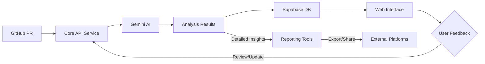

# AI-Integrated Code Pipeline 

This is an innovative AI-powered analysis tool designed to enhance code review and pull request management using cutting-edge AI technologies.

## Usage

### Prerequisites
- A GitHub repository
- GitHub Actions enabled
- An account on [Bunjy AI](https://bunjy.vercel.app)

### Step 1: Generate API Credentials
1. Visit [Bunjy AI](https://bunjy.vercel.app)
2. Log in with your GitHub account
3. On the homepage sidebar click and navigate to "Access Tokens"
4. Generate a new API Key and Base app url by clicking the generate button
5. Copy your unique `API_KEY ` and `BASE_APP_URL`

### Step 2: Configure Repository Secrets
In your GitHub repository:
1. Go to "Settings"
2. Select "Secrets and variables"
3. Click "New repository secret"
4. Add the two secrets:
   - Name: `BASE_APP_URL`
     - Value: Your unique base URL from Bunjy AI
   - Name: `API_KEY`
     - Value: Your generated API key
5. **NOTE: The action DOES NOT needs a personal TOKEN from github**, if not provided it defaults to the one provided by github actions automatically.

I will soon find a way to use the action without the `BASE_APP_URL` specified, making it more flexible and easier to configure.

### Step 3: Create Workflow File
Create a `.github/workflows/ai.yml` file in your repository, use this template to set up:

```yaml
name: AI Code Review

on:
  pull_request:
    branches:
      '*'

jobs:
  ai:
    runs-on: ubuntu-latest
    steps:
      - name: Checkout code
        uses: actions/checkout@v4

      - name: Bunjy-AI              
        uses: mohswell/mintify@v2.0
        with:
          BASE_APP_URL: ${{ secrets.BASE_APP_URL }}
          API_KEY: ${{ secrets.API_KEY }}
```

## How It Works: Technical Architecture

### 1. Authentication and Integration
- Users setup the action in their workflows.
- The action requires a `BASE_APP_URL` and `API_KEY` defined in your respository secrets.
- You'll visit the dashboard page at [Bunjy AI](https://bunjy.vercel.app) to generate an `API_KEY` and also copy the `BASE_APP_URL`.
- Users can log in using GitHub OAuth to authorize my core service.
- The application connects directly to GitHub repositories via the action workflow.
- Securely retrieves repository and pull request data. 
- Encrypts the repository data and sends it to the web server for processing/decrypting and then sends it to Gemini AI.
- Displays AI reviews for your code changes directly within the PR opened, or in the dahboard [homepage](https://bunjy.vercel.app/home).

### 2. AI Analysis Process
1. When a pull request is opened, the app:
   - Captures code changes
   - Analyzes commit messages
   - Processes repository context
   - Runs AI models (Gemini Nano) to evaluate:
     - Code quality
     - Potential risks
     - Improvement suggestions
     - Reviewer recommendations

### 3. Data Flow

---

## 🛠️ What Does This App Do?

This application provides intelligent insights into GitHub pull requests by analyzing:
- Code changes, commit messages, and statistics.
- AI-driven suggestions for PR quality improvements.
- PR risk assessments based on AI analysis.
- Reviewer suggestions and code quality highlights.
- Insights displayed directly in GitHub Pull Requests
- Comprehensive analysis available in Bunjy AI dashboard

### Apps and Packages

- **`web`**: The main user-facing [Next.js](https://nextjs.org/) application for viewing and managing pull request analyses.
- **`api`**: The backend core service powered by [Prisma](https://www.prisma.io/) and [Nest.js](https://nestjs.com/) for interacting with the database and integrating AI services like Gemini.
- **`workflows/scripts`**: This repository includes various shell scripts to automate different tasks:

1. Analyzes files in the repository to gather insights and metrics.
2. Sets up the necessary environment variables required for the application.
3. Sends metadata to the server for further processing and analysis.
4. Processes comments in pull requests to provide feedback and suggestions.

---

### Installation

Clone the repository and install dependencies:

```bash
git clone https://github.com/mohswell/mintify.git
cd mintify
npm install
```

```bash
npm install turbo --save-dev
```

---

### Environment Variables

Configure environment variables in `.env`, `.env.local`, or `.env.template` for different environments.

#### Root `.env` Example:
```env
DATABASE_URL=""
DIRECT_URL=""
```

#### For the Frontend go to `web` and create a `.env.local` Example:
```env
NEXT_PUBLIC_SUPABASE_URL=""
NEXT_PUBLIC_SUPABASE_ANON_KEY=""
SUPABASE_SERVICE_ROLE_KEY=""
NEXTAUTH_URL="http://localhost:3000"
NEXTAUTH_SECRET=""
NEXT_PUBLIC_AUTH_REDIRECT_URL="http://localhost:3000"
GITHUB_CLIENT_ID=""
GITHUB_SECRET=""
NEXT_PUBLIC_API_BASE_URL="http://localhost:8000/api/v1"
```

#### For the Backend go to `api` and create a `.env` Example:
```env
GEMINI_API_KEY=""
GEMINI_PRO_MODEL="gemini-pro"
GEMINI_PRO_VISION_MODEL="gemini-pro-vision"
PORT=8000
JWT_SECRET=""
DATABASE_URL=""
```

---

### Scripts

Here are the key npm scripts for managing the monorepo:

| Command           | Description                                              |
|-----------------  |----------------------------------------------------------|
| `turbo run build` | Builds all apps and packages.                            |
| `rubo run dev`    | Starts the development servers for all apps.             |
| `turbo run lint`  | Runs ESLint across all apps and packages.                |
| `turbo run format`| Formats code using Prettier.                             |
| `turbo run start` | Starts the whole application in production mode.         |

---

### Development

To start the development environment for all apps and packages:

```bash
turbo run dev
```

To build all apps and packages for production:

```bash
turbo run build
```

---

## License

The repository is licensed under GNU GENERAL PUBLIC LICENSE, ensuring proper attribution and restricted commercial use. See the `LICENSE` file for details.

---

## ☕ Buy Me a Coffee

If you find this project helpful and would like to support its development, consider buying me a coffee:

[](https://buymeacoffee.com/mohswell)

Your support is greatly appreciated!

---


## Contributing

Contributions are welcome! Please fork the repo and create a pull request with your changes and tag me in to review your features.


## Future Roadmap

- Enhanced AI models
- More granular code analysis
- Machine learning improvements
- Extended language support

---

## Contact

If you have questions or suggestions, feel free to [open an issue](https://github.com/mohswell/mintify/issues) or contact me directly at [Muhammad.Said](mailto:mohammedabdy10@gmail.com).

---
